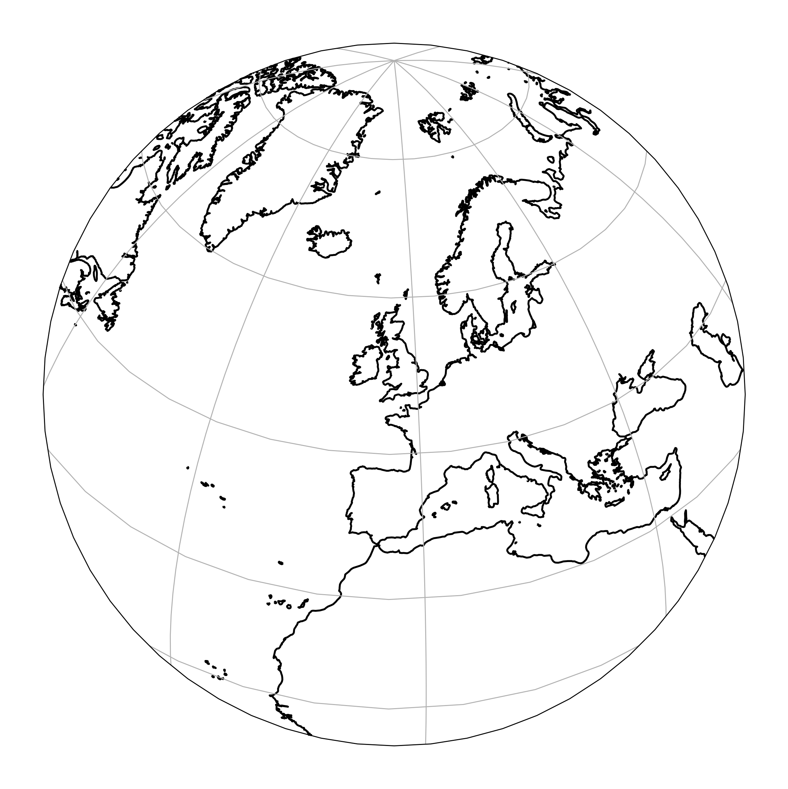
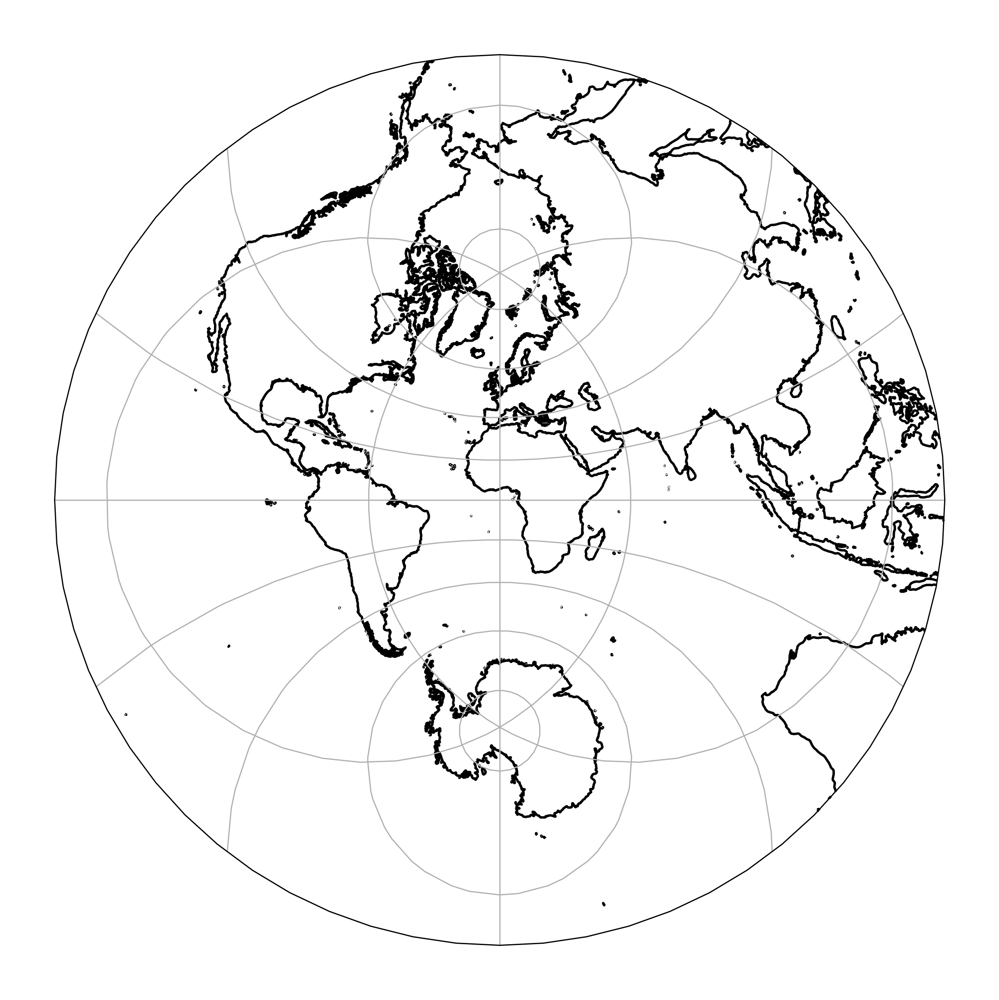

## Python scientifique
**Traitement de l'information, cartographie**

Le cours est une introduction ou une remise à niveau à la programmation appliquée à la cartographie, en utilisant le langage Python.

Il se déroule sur cinq jours: à l'exception du dernier, les matinées seront consacrées à des rappels théoriques et des exercices académiques. Les après-midis seront organisées en séances de travaux pratiques pour manipuler les notions acquises.

 

### Jour 1 : Les bases du langage

Tour de table

**Théorie**

- Les bases du langage
- Les structures de données
- La bibliothèque standard Python

**Travaux pratiques**

- *La mesure du rayon de la Terre*, à partir des mesures de Cassini (1738)

*Références*:

- Émission de France Culture du [12 avril 2016](https://www.franceculture.fr/emissions/la-fabrique-de-l-histoire/cartes-24-les-cassini-carte-sur-table)

### Jour 2 : Python scientifique

**Théorie**

- Les bibliothèques de calcul numpy/scipy; Matplotlib; iPython
- Modules et interfaces

**Notebooks**

- Les [compréhensions de liste](./notebooks/00-list-comprehensions.ipynb) (à lire impérativement après la séance)
- [Python scientifique](./notebooks/01-scientific-python.ipynb)
- [`pandas`](./notebooks/02-pandas.ipynb) (optionnel, à faire après la séance)
- [`scipy.integrate`](./notebooks/03-scipy-integrate.ipynb)
- [`scipy.optimize`](./notebooks/04-scipy-optimize.ipynb) (optionnel, à lire après la séance)

**Travaux pratiques**

- *Cartes du monde, cartes de France*; manipulation de projections standard (Mercator, Lambert 93) et utilisation tracé de cartes

### Jour 3 : Programmation orienté objet

**Théorie**

- Python orienté objet

**Travaux pratiques**

- *Trajectographie de la station spatiale internationale*

### Jour 4 : Compléments

En fonction de l'avancement et de l'intérêt du groupe pour la séance de la veille, on pourra continuer la séance de travaux pratiques de la veille, préparer la campagne de mesures, et/ou aborder le sujet suivant:

- Python avancé

**Notebooks**

- [Cython](./notebooks/05-cython.ipynb) (optionnel)

**Travaux pratiques**

- Campagnes de mesures ADS-B

### Jour 5 : Projet final

L'objectif de la journée est de mettre en pratique les connaissances acquises dans le semaine pour mettre en commun les données collectées la veille et en proposer une visualisation.

Il s'agit de tracer un fond de carte avec d'une couleur, les trajectoires des avions qui atterrissent sur les aéroports parisiens d'Orly (ORY/LFPO) et de Charles de Gaulle (CDG/LFPG), et d'une autre, les trajectoires d'avions qui en décollent.

Dans un premier temps, il s'agira de tracer les données collectées par un groupe, puis une fois cette première carte produite, de faire une deuxième carte avec toutes les données fusionnées.
